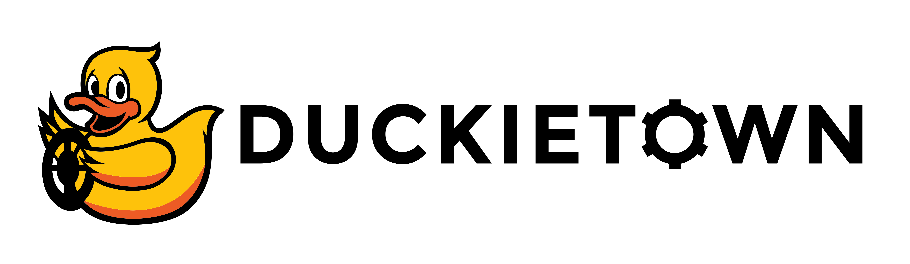

<p align="center">

</p>

# **Part 2: Object Detection**

# About these activities

This learning experience will take you through the process of collecting data from the Duckietown simulator and formatting it to be used to train a neural network to perform object detection using the robot's camera image. 
We will use one of the most popular object detection neural networks, called [YOLO (v5)](https://docs.ultralytics.com/). You will also have to integrate this trained model into the autonomy stack. For now we will just stop whenever an object (duckie) is detected in the road. 


# Instructions

**NOTE:** All commands below are intended to be executed from the root directory of this exercise (i.e., the directory containing this README).


## 1. Make sure your system is up-to-date

- 💻 Always make sure your Duckietown Shell is updated to the latest version. See [installation instructions](https://github.com/duckietown/duckietown-shell)

- 💻 Update the shell commands: `dts update`

- 💻 Update your laptop/desktop: `dts desktop update`

- 🚙 Update your Duckiebot: `dts duckiebot update ROBOTNAME` (where `ROBOTNAME` is the name of your Duckiebot chosen during the initialization procedure.)


## 2. Work on the exercise

### Launch the code editor

Open the code editor by running the following command,

```
dts code editor
```

Wait for a URL to appear on the terminal, then click on it or copy-paste it in the address bar
of your browser to access the code editor. The first thing you will see in the code editor is
this same document, you can continue there.


### Walkthrough of notebooks

**NOTE**: You should be reading this from inside the code editor in your browser.

Inside the code editor, use the navigator sidebar on the left-hand side to navigate to the
`notebooks` directory and open the first notebook.

Follow the instructions on the notebook and work through the notebooks in sequence.


### 💻 Testing in simulation

To test in simulation, use the command

    $ dts code workbench --sim

There will be two URLs popping up to open in your browser: one is the direct view of the
simulated environment. The other is VNC and only useful for some exercises, follow the instructions
in the notebooks to see if you need to access VNC.

This simulation test is just that, a test. Don't trust it fully. If you want a more accurate
metric of performance, continue reading to the `Perform local evaluation` section below.


### 🚙 Testing on a physical robot

You can test your agent on the robot using the command,

    dts code workbench --duckiebot YOUR_DUCKIEBOT

This is the modality "everything runs on the robot".

You can also test using

    dts code workbench --duckiebot YOUR_DUCKIEBOT --local 

This is the modality "drivers running on the robot, agent runs on the laptop."


### 📽 Perform local evaluation

We suggest you evaluate your work locally before submitting your solution.
You can do so by running the following command,

    dts code evaluate

This should take a few minutes.
This is not supposed to be an interactive process: just let it run, and when you return,
you will find the output in a folder, including videos, and trajectories, and all the statistics
you would usually find on the website.

